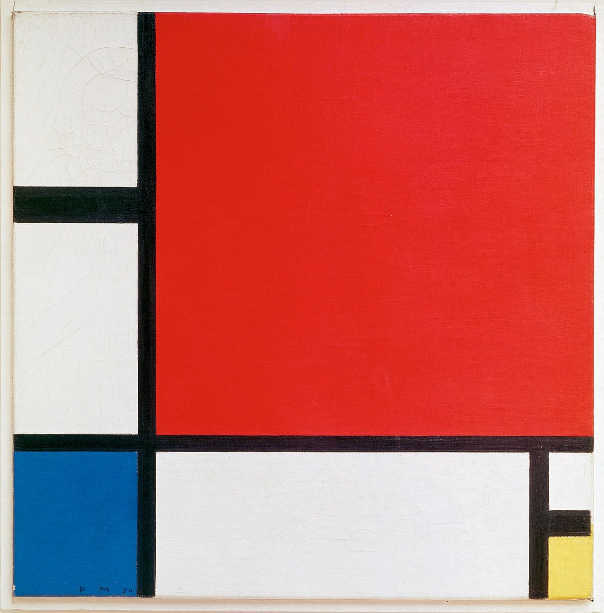

This is a [Next.js](https://nextjs.org/) project bootstrapped with [`create-next-app`](https://github.com/vercel/next.js/tree/canary/packages/create-next-app)and deployed on [Vercel Platform](https://vercel.com/new?utm_medium=default-template&filter=next.js&utm_source=create-next-app&utm_campaign=create-next-app-readme) from the creators of Next.js.

Click [here](https://composition-with-red-blue-yellow-mondrian-reconstruction.vercel.app/) to see it live! 

I reconstructed Piet Mondrian's Composition with Red, Blue and Yellow (1930) with CSS!
It has been scaled to 450x450px with respect to the painting's original dimensions of 45 x 45 cm.

  
  
Image Source: Wikipedia

Something interesting during this fun exercise was that when I first thought I had completed it, I seemed to be about one pixel off and after on checking back to the original painting, I found that there was this detail I had missed where Mondrian did not paint the black line in the bottom right corner to the edge of the canvas.

  
   
Image Source: Wikipedia

And of course I had to recreate it as well to pay homage to Mondrian and his work!

  
    
A GIF of the step-by-step reconstruction process!

